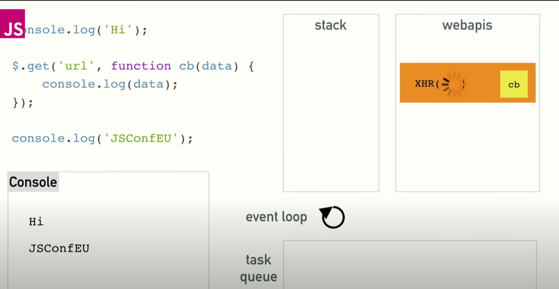
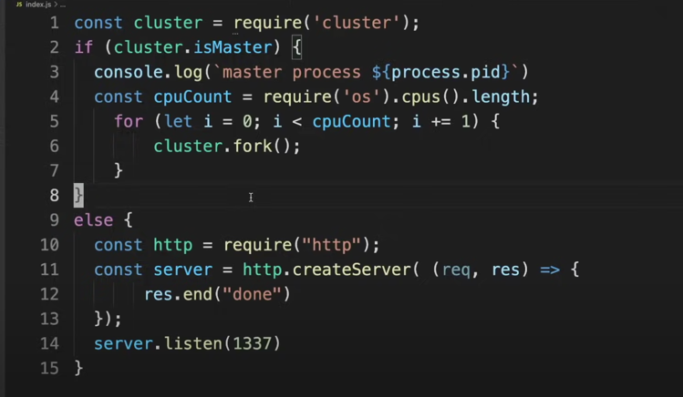

# Executors, Callables

## Executor

The `Executor` interface is used to execute tasks. It is a generic interface that can be used to execute any kind of task. The `Executor` interface has only one method:

```java
public interface Executor {
    void execute(Runnable command);
}
```

The `execute` method takes a `Runnable` object as a parameter. The `Runnable` interface is a functional interface that has only one method. Executors internally use a thread pool to execute the tasks. The `execute` method is non-blocking. It returns immediately after submitting the task to the thread pool. The `execute` method is used to execute tasks that do not return a result.

A thread pool is a collection of threads that are used to execute tasks.
Instead of creating a new thread for each task, a thread pool reuses the existing threads to execute the tasks. This improves the performance of the application.

The `Executor` interface has a method called `newCachedThreadPool` that returns an `ExecutorService` object. The `ExecutorService` interface extends the `Executor` interface. The `ExecutorService` interface has methods to execute tasks that return a result. The `ExecutorService` interface also has methods to shutdown the thread pool.

To run a task using the `Executor` interface, we can use the `newCachedThreadPool` method to create an `ExecutorService` object. The `newCachedThreadPool` method returns an `ExecutorService` object that uses a thread pool with a variable number of threads. The `newCachedThreadPool` method creates a new thread for each task if there are no idle threads in the thread pool. If there is an idle thread in the thread pool, the `newCachedThreadPool` method reuses the idle thread to execute the task. The `newCachedThreadPool` method returns an `ExecutorService` object that uses a thread pool with a variable number of threads.

```java
Executor executorService = Executors.newCachedThreadPool();
executorService.execute(() -> System.out.println("Hello World"));
```

## Callable and Future

Runnables do not return a result. If we want to execute a task that returns a result, we can use the `Callable` interface. The `Callable` interface is a functional interface that has only one method:

```java
public interface Callable<V> {
    V call() throws Exception;
}
```

The `call` method returns a result of type `V`. The `call` method can throw an exception. The `Callable` interface is used to execute tasks that return a result.
For instance we can use the `Callable` interface to execute a task that returns the sum of two numbers:

```java
Callable<Integer> sumTask = () -> 2 + 3;
```

In order to execute a task that returns a result, we can use the `submit` method of the `ExecutorService` interface. The `submit` method takes a `Callable` object as a parameter. The `submit` method returns a `Future` object. The `Future` interface has a method called `get` that returns the result of the task. The `get` method is a blocking method. It waits until the task is completed and then returns the result of the task.

```java
ExecutorService executorService = Executors.newCachedThreadPool();
Future<Integer> future = executorService.submit(() -> 2 + 3);
Integer result = future.get();
```

Futures can be used to cancel tasks. The `Future` interface has a method called `cancel` that can be used to cancel a task. The `cancel` method takes a boolean parameter. If the boolean parameter is `true`, the task is cancelled even if the task is already running. If the boolean parameter is `false`, the task is cancelled only if the task is not running.

```java
ExecutorService executorService = Executors.newCachedThreadPool();
Future<Integer> future = executorService.submit(() -> 2 + 3);
future.cancel(false);
```
## Concurrency in Node JS
NodeJs is Single Threaded Open Source Virtual Machine tht uses Javascript as its scripting language.
Despite being single threaded, is Asynchronous and handle concurrency, perform multiple I/O operations at the same time.

Node JS uses Even Loop to maintain its concurrency and perform non blocking I/O operations.
It is suitable only for I/O Intensive Process - and will not be suitable for CPU/Compute intensive processes.

### How does Event Loop Work
Node JS is Non-Blocking , Single Threaded Virtual Machine.

`Single Threaded` means it has only one thread, that does the processing of requests.

`Non-Blocking` means the code does not wait for the given operation/task to complete, thus runs the next requests without being blocked, this means your requests are handled asynchronously.  

In the Below Image, you see that there is an `event loop` , `task queue`, `call stack`, `web-apis`. These work together to perform the `Event Loop Cycle`.
* As the code progresses, each function/line execution is put into the `call stack`, and the execution happens from the `call stack` like any other programing language
* the `event loop` runs a cycle (`cycle ticks`), and transfers the tasks from `task queue` to bottom of the `call stack` for execution.
  * If , there is a need for an I/O operation like, $.get - nodejs puts a request to  `webapis` OR `libuv` which provides Non Blocking I/O capabilities.
  * Once the I/O operation is done, `libuv` puts a callback to the `task queue` with the result of the I/O process.
  * In the next `event loop cycle`, even loop will take that task from `task queue` and put it inside the `call stack`.
  * Refer [this](https://www.youtube.com/watch?v=8aGhZQkoFbQ)  wonderful video for more information.

</img>

Even though, Node JS is a Single Threaded VM, behind the scenes, it makes use of `libuv` (written in C).
`Libuv` has access to System Kernel, and thus can be Multi-Threaded.

The below Image provides a snapshot of how we should be forking a node js process in a multi-core 

</img>


# Thread synchronisation

`Critical Section` is the part of the code, that is working on shared piece of data/resource.

When more than one thread is working on the same resource/data (OR) in a `Critical Section` , at the same time, it can lead to inconsistent, potentially wrong results.
In such cases, we need to make sure that the threads do not interfere with each other. This is called synchronisation.

`Example`
Synchronisation can be seen in the adder and subtractor example. The adder and subtractor threads access the same counter variable. If the adder and subtractor threads do not synchronise, the counter variable can be in an inconsistent state.

* Create a count class that has a count variable.
* Create two different classes `Adder` and `Subtractor`.
* Accept a count object in the constructor of both the classes.
* In `Adder`, iterate from 1 to 100 and increment the count variable by 1 on each iteration.
* In `Subtractor`, iterate from 1 to 100 and decrement the count variable by 1 on each iteration.
* Print the final value of the count variable.
* What would the ideal value of the count variable be?
* What is the actual value of the count variable?
* Try to add some delay in the `Adder` and `Subtractor` classes using inspiration from the code below. What is the value of the count variable now?


## Other References
[How does thread pool work in node.js ?](https://medium.com/@r_joydip/how-does-thread-pool-work-in-node-js-c48f3b3662a9)
[When is NodeJS Single Threaded, and when it is Multi Threaded](https://www.youtube.com/watch?v=gMtchRodC2I)